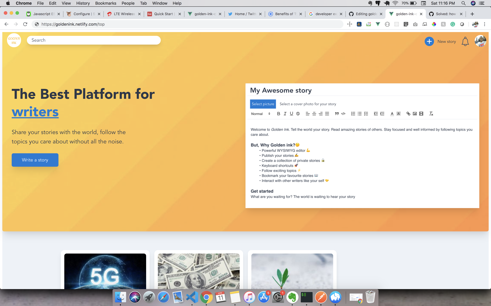
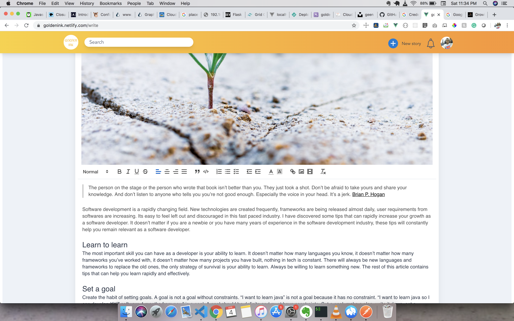
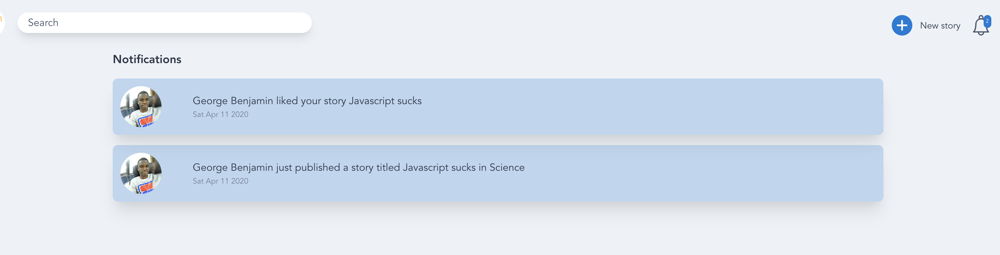

# Golden ink
### A fantastic publishing platform for writers.
Share your stories with the world, follow the topics you care about without all the noise.

### Features
- A powerful WYSIWYG editor, no need to remember markdown syntax anymore😁
- Easily get started using your Google account
- Publish articles
- Save private stories
- Follow topics you care about
- Interact with other writers
- Get realtime notifications when people react to your story
- Easily bookmark your favourite stories to read later

### Screenshots

### Technologies
- Vue
- Typescript
- TailwindCSS

### Project setup
- Clone the repo
- `cd` into the repo
- Run `npm install`
- Run `npm run serve`

### Compiles and minifies for production

### Customize configuration
See [Configuration Reference](https://cli.vuejs.org/config/).

### Author
George Benjamin
